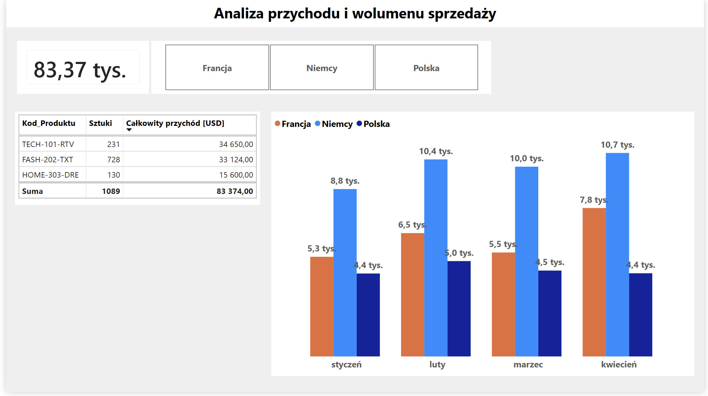

# 📊 E-Commerce Multi-Country Sales Dashboard (Automated Data Pipeline)



## 📌 Project Overview
This project delivers an interactive, end-to-end **Power BI Dashboard** designed to consolidate and analyze multi-country e-commerce sales performance (Poland, Germany, France). 

The key technical achievement of this project is a **100% automated ETL pipeline** built in Power Query. It dynamically ingests raw `.csv` sales files from a directory, transforms unpivoted wide-format monthly data into a standardized vertical schema, and resolves schema drift (such as new months or countries being added over time) without breaking the reporting layer.

---

## 🛠️ Tech Stack & Skills Demonstrated
* **BI Tool:** Power BI Desktop
* **Data Transformation (ETL):** Power Query (M Language)
* **Data Modeling & DAX:** Custom Calculated Columns & Aggregations
* **Key Techniques:**
  * Automated Folder Data Import
  * Dynamic Column Unpivoting (`Table.UnpivotOtherColumns`)
  * Data Type Normalization & Cleansing
  * Dynamic Aggregations & Categorical Grouping

---

## 🚀 Key Features & Functionalities

1. **Automated Data Ingestion:**
   * Ingests individual country sales files (`Sprzedaz_Polska.csv`, `Sprzedaz_Niemcy.csv`, `Sprzedaz_Francja.csv`) automatically.
   * Dynamically handles schema changes (e.g., adding dynamic new months or new regional files) via robust M transformation steps.

2. **Sales & Volume Analytics:**
   * **Total Revenue & Volume by SKU:** Summarizes total units sold (`Sztuki`) and total revenue (`Wartosc_USD`) grouped by unique product codes (`Kod_Produktu`) without duplicates.
   * **Regional Performance:** Interactive slicers allowing drill-down by Country and Month.
   * **Product Metrics:** Calculated total transaction values using custom DAX logic (`Sztuki * Cena_USD`).

---

## 📐 Data Modeling & DAX Calculations

To complement the ETL pipeline, custom DAX logic was created to calculate core revenue metrics dynamically:

* **Calculated Column (Transaction Value):**
  ```dax
  Wartosc_USD = Projekt_Ecommerce[Sztuki] * Projekt_Ecommerce[Cena_USD]
  ```

---
  
## ⚙️ Data Pipeline Architecture (ETL Steps)

[ Raw Country CSV Files ]
│
▼ (Folder Import in Power Query)
[ Schema Standardization & File Isolation ]
│
▼ (Unpivot Other Columns: Product Code & Price)
[ Vertical Data Model: Product | Price | Month | Units | Country ]
│
▼ (Type Normalization: Text to Int / Currency)
[ Consolidated Data Model in Power BI ]

---

## 📖 How to Run This Project Locally

1. Clone or download this repository.
2. Place the sample `.csv` files into a directory on your local machine.
3. Open `Projekt_Ecommerce.pbix` in **Power BI Desktop**.
4. In Power Query, update the Source Folder path to point to your local data folder.
5. Click **Refresh** to run the automated transformation pipeline.
